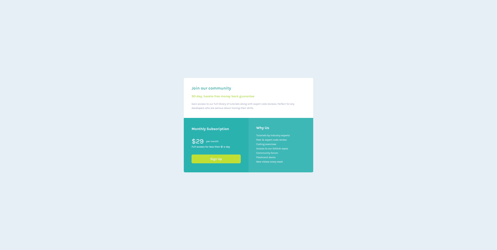

# Frontend Mentor - Single price grid component solution

This is a solution to the [Single price grid component challenge on Frontend Mentor](https://www.frontendmentor.io/challenges/single-price-grid-component-5ce41129d0ff452fec5abbbc). Frontend Mentor challenges help you improve your coding skills by building realistic projects. 

## Table of contents

- [Overview](#overview)
  - [The challenge](#the-challenge)
  - [Screenshot](#screenshot)
  - [Links](#links)
- [Author](#author)

## Overview

### The challenge

Users should be able to:

- View the optimal layout for the component depending on their device's screen size
- See a hover state on desktop for the Sign Up call-to-action

### Screenshot

### Links

- Solution URL: [https://github.com/lcabrera13/single-price-grid-component-solution.git](https://github.com/lcabrera13/single-price-grid-component-solution.git)
- Live Site URL: [https://single-price-grid-component-solution-two.vercel.app](https://single-price-grid-component-solution-two.vercel.app)

## Author

- Website - [Luis Cabrera](https://lcabrera13.github.io/)
- Frontend Mentor - [@lcabrera13](https://www.frontendmentor.io/profile/lcabrera13)
- GitHub - [@lcabrera13](https://github.com/lcabrera13)